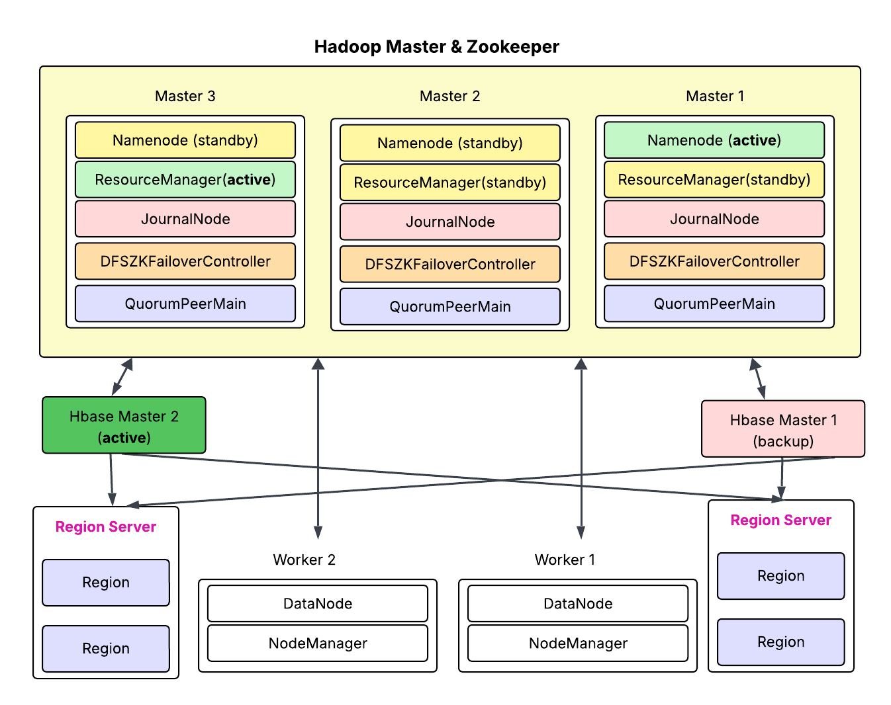

# HadoopFortress: HBase High Availability Cluster on Docker

This project is an extension of my previous Hadoop High Availability repository, now enhanced with a fully configured **HBase cluster** featuring complete high availability capabilities.

A production-ready, fully containerized **HBase cluster** with **High Availability** running on Hadoop:

- **HBase HA** with active/standby masters and multiple region servers
- HDFS NameNode HA with Quorum Journal Manager (from previous project)
- YARN ResourceManager HA (from previous project)
- ZooKeeper ensemble for coordination

This setup is designed for resilience, scalability, and easy testing in a local or cloud environment.

## Features

- **HDFS HA** with automatic failover
- **YARN RM HA** for resource scheduling redundancy
- **HBase Master HA** with ZooKeeper-managed failover
- Multiple **HBase RegionServers**
- Centralized **ZooKeeper ensemble**
- Web UIs exposed for easy monitoring
- Health checks and restart policies for stability

---

## Architecture Overview



- 3 Hadoop Master Nodes (NameNode, ResourceManager, JournalNode, ZooKeeper)
- 2 HBase Master Nodes
- Multiple Worker Nodes (DataNode, NodeManager, HBase RegionServer)
- Shared volumes for configs and data persistence

---

## Web Interfaces

#### NameNode

| Node       | URL                          |
|------------|------------------------------|
| Master1    | [localhost:9879](http://localhost:9879) |
| Master2    | [localhost:9880](http://localhost:9880) |
| Master3    | [localhost:9881](http://localhost:9881) |

#### ResourceManager

| Node       | URL                          |
|------------|------------------------------|
| Master1    | [localhost:8078](http://localhost:8078) |
| Master2    | [localhost:8079](http://localhost:8079) |
| Master3    | [localhost:8080](http://localhost:8080) |

#### RHBase Master

| Component            | URL                    |
|----------------------|------------------------|
| HBase Master 1 UI     | http://localhost:16010 |
| HBase Master 2 UI     | http://localhost:16011 |

---

## Configuration Highlights

- **HBase HA** configured via `hbase-site.xml` to use ZooKeeper for master failover.
- RegionServers register with active HBase Master automatically.
- Hadoop configs (`core-site.xml`, `hdfs-site.xml`, `yarn-site.xml`) set for HA mode.
- `docker-compose.yml` defines all containers with appropriate roles, ports, and dependencies.

---

## Getting Started

### Prerequisites
- Docker & Docker Compose installed
- Sufficient memory and CPU (recommended 8+ GB RAM)

### Launch Cluster

```bash
docker-compose up -d
```

### Verify HBase Status

Enter HBase shell on master container:

```bash
docker exec -it hb-master1 hbase shell
```

Run:

```bash
status 'detailed'
```
You should see both active and standby masters, plus region servers online.


### Testing HBase HA

1. Create a test table:
```bash
create 'test', 'cf'
put 'test', 'row1', 'cf:col1', 'value1'
scan 'test'
```
---

### Simulate failover:

- Stop active HBase master container (hb-master1).
- Observe standby master (hb-master2) automatically takes over.
- Run status 'detailed' again to confirm.

###  Resources

- [Apache HBase HA Guide](https://hbase.apache.org/book.html#_high_availability)
- [HDFS High Availability](https://hadoop.apache.org/docs/stable/hadoop-project-dist/hadoop-hdfs/HDFSHighAvailabilityWithQJM.html)
- [YARN ResourceManager HA](https://hadoop.apache.org/docs/stable/hadoop-yarn/hadoop-yarn-site/ResourceManagerHA.html)
- [ZooKeeper Documentation](https://zookeeper.apache.org/doc/current/)


## Contributing
Pull requests are welcome. For major changes, please open an issue first to discuss what you would like to change.


